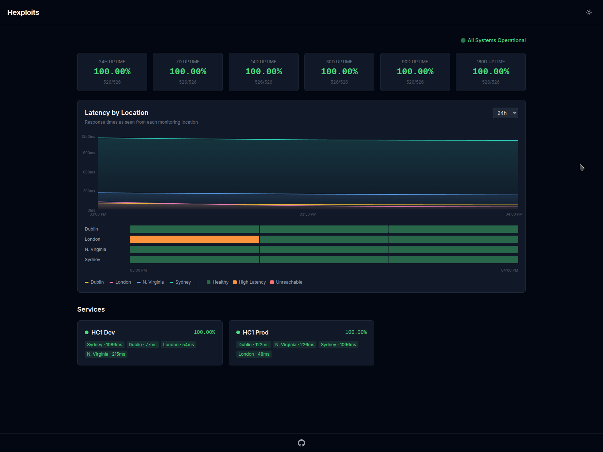
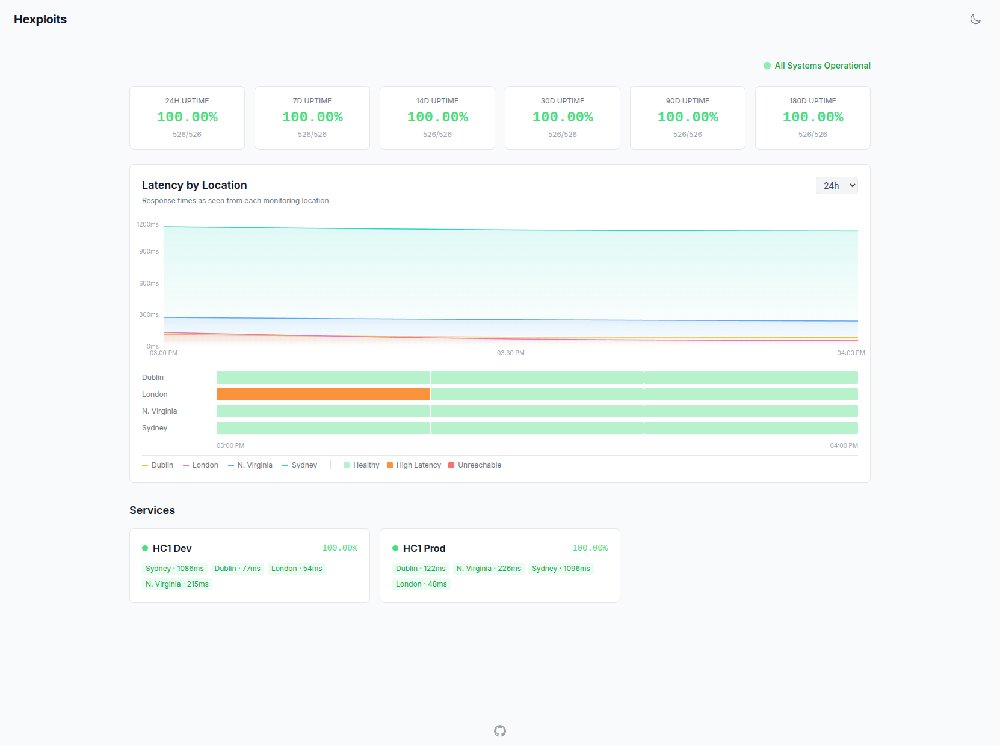
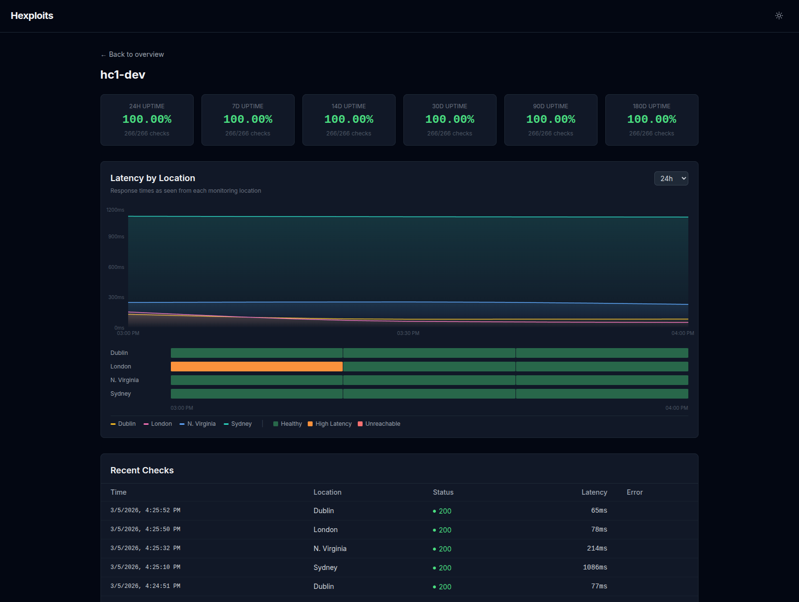
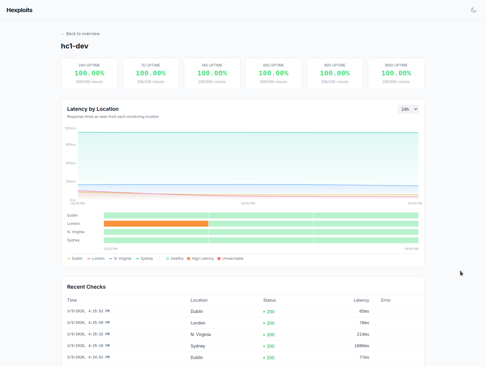

# healthz.sh

Multi-region API health checker on AWS. Lambdas run in N regions on a schedule, check your endpoints, and write results to a DynamoDB global table. A static Next.js dashboard on CloudFront shows uptime, latency by region, and health status.

## Screenshots

<p>
  
  
</p>
<p>
  
  
</p>

## Architecture

```
healthz.yaml
     │
     ├── DynamoDB Global Table (primary region + replicas)
     ├── Lambda Checker × N regions (EventBridge scheduled)
     └── CloudFront → S3 (static UI) + API Gateway → Lambda (API)
```

## Quick Start

**Prerequisites:** Node.js 22+, AWS CLI (configured), Docker (for local dev only)

### Deploy to AWS

1. Copy the example config and edit it with your endpoints, regions, and branding:

```bash
cp healthz.yaml.example healthz.yaml
```

2. Edit `healthz.yaml` with your endpoints and regions (see [Configuration](#configuration) below)

3. Deploy:

```bash
aws sso login          # or however you authenticate
./deploy.sh
```

The script handles everything: CDK bootstrap, build, deploy, and prints the dashboard URL.

> **Note:** `healthz.yaml` contains your specific endpoints and infrastructure settings and is excluded from version control via `.gitignore`. Only the example file is tracked.

### Local Development

```bash
npm ci
npm run dev:db         # start DynamoDB Local (Docker)
npm run dev:seed       # seed with realistic test data
npm run dev            # start API + UI on localhost:3000
```

To see your branding locally, prefix with the environment variables:

```bash
NEXT_PUBLIC_COMPANY_NAME="My Company" NEXT_PUBLIC_COMPANY_URL="https://example.com" npm run dev
```

## Configuration

All configuration lives in `healthz.yaml`. Start by copying the example:

```bash
cp healthz.yaml.example healthz.yaml
```

```yaml
checks:
  - name: My API             # display name (slugified for storage)
    url: https://example.com/health
    interval: 5m             # check frequency: 1m, 5m, 15m, 1h, etc.
    timeout: 10s             # request timeout: 5s, 10s, 30s
    expected_status: 200     # HTTP status that means healthy
    method: GET              # optional, defaults to GET
    headers:                 # optional request headers
      Authorization: Bearer xxx

regions:
  - us-east-1               # each region gets its own Lambda checker
  - eu-west-1
  - ap-southeast-2

settings:
  primary_region: eu-west-1  # dashboard + master DB deployed here
  retention_days: 180        # auto-delete old data via DynamoDB TTL
  table_name: healthz-checks

branding:
  company_name: My Company   # shown in the dashboard header
  company_url: https://example.com  # header name links here
```

### What each setting does

| Setting | Effect |
|---|---|
| `checks[].interval` | EventBridge rule schedule for that check |
| `checks[].timeout` | `AbortController` timeout on the Lambda's `fetch()` call |
| `checks[].expected_status` | Response status compared against this to determine `healthy: true/false` |
| `regions` | One Lambda + EventBridge rules deployed per region. DynamoDB replicas in each. |
| `primary_region` | Where the dashboard (S3 + CloudFront + API Gateway) and master DynamoDB table live |
| `retention_days` | TTL on DynamoDB records — data auto-expires after this period. Supports up to 180 days for the dashboard time range selector. |
| `branding.company_name` | Displayed in the top-left of the dashboard header |
| `branding.company_url` | The header company name links to this URL |

### Custom Domain

By default, your dashboard is served on a CloudFront-generated URL (e.g. `d1234abcd.cloudfront.net`). To serve it on your own domain instead, add a `domain` block to your config. This attaches your domain to the CloudFront distribution with a valid SSL certificate.

#### Cloudflare / External DNS

Add the domain names to the config:

```yaml
domain:
  names:
    - status.example.com
```

Run `./deploy.sh`. On first run it will:

1. Request an ACM certificate in us-east-1 (free)
2. Print the DNS validation records you need to add with your DNS provider
3. Exit and ask you to re-run

Add the CNAME validation records with your DNS provider (if using Cloudflare, use **DNS only / grey cloud, not proxied**), wait a minute, then re-run `./deploy.sh`. It picks up where it left off — validates the cert, deploys everything, and prints the final CNAME to point your domain at CloudFront.

After deployment, create a CNAME record pointing your domain to the CloudFront distribution domain printed in the output. Keep the ACM validation CNAME record in place permanently — AWS uses it to auto-renew the certificate.

#### Route53

If your DNS is in Route53, it's fully automated — no manual steps:

```yaml
domain:
  names:
    - status.example.com
  hosted_zone_id: Z0123456789
  zone_name: example.com
```

CDK creates the certificate, validates it via Route53, and creates the alias record to CloudFront. One `./deploy.sh` and you're done.

## Updating

Change `healthz.yaml` and re-run `./deploy.sh`. The deploy is idempotent:

- Adding/removing regions creates/destroys checker stacks and DynamoDB replicas
- Changing intervals updates EventBridge rules in-place
- Changing the primary region migrates the dashboard and cleans up the old one
- Unchanged stacks are skipped (no-op)

## Tear Down

```bash
cd infra && npx cdk destroy --all
```

The DynamoDB table uses a `RETAIN` policy — delete it manually from the AWS console if needed.

## Cost

For small-scale use (a few checks, 3-4 regions, 1-5min intervals), this runs within AWS free tier or costs a few cents/month.

## License

MIT — see [LICENSE](LICENSE).
